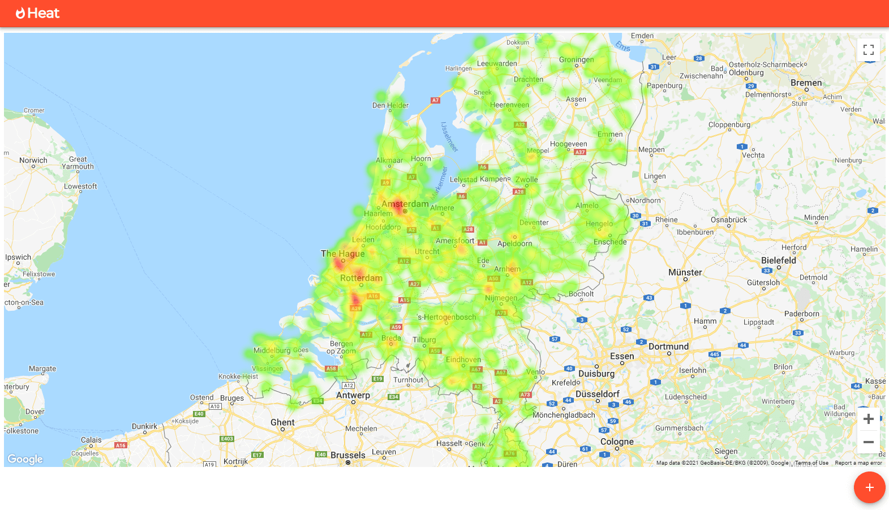

# Heat :fire:

A heat map project with React and Spring Boot




#### Requirements :earth_americas:

| Requirement   | Use |
| ------------- | -------------- |
| Node 12.x     | React |
| Yarn          | Build react-heat |
| Maven 3.6.x   | Build heat-service |
| Java 8.x      | Run heat-service |
| Docker        | Run PostgreSQL |

#### Folder Structure

```
- Heat
    - dev      ## Config to run in dev mode
    - service  ## Back-end Java/Spring
    - web      ## Front-end React 
```

### How to run :runner:

**1° step** - Start Docker image with `postgres` :whale:

```bash
docker-compose -f docker-compose.yml up -d
```

**2° step** - Start heat-service :computer:

```bash
cd service && mvn clean install && mvnw spring-boot:run
```

**3° step** - Start react-heat :globe_with_meridians:

> Add your Google Maps key in `web\.env` param name `REACT_APP_MAPS_API_KEY`

```bash
cd web && yarn && yarn start
```

**4° step** - [Download _NGINX_](http://nginx.org/en/download.html) or use an existing on your machine, copy the `dev/nginx/nginx.conf` file to `conf` folder inside _nginx_ and then start _nginx_.

Access application by [http://localhost](http://localhost)

### Extra

In the `dev` folder there is a sql file with 90 residences.

Run it, to visualize the map with several residences

### To do

- [ ] Tests to React
- [ ] Tests to Spring Java
- [x] Fix form layout
- [x] Fix home layout
- [ ] Sonarqube integration to see (coverage, bugs and vulnerabilities)
- [ ] Move nginx to docker
- [x] Github actions to React
- [x] Github actions to Spring

----

Made with :heart: by Gaboso™ 2021